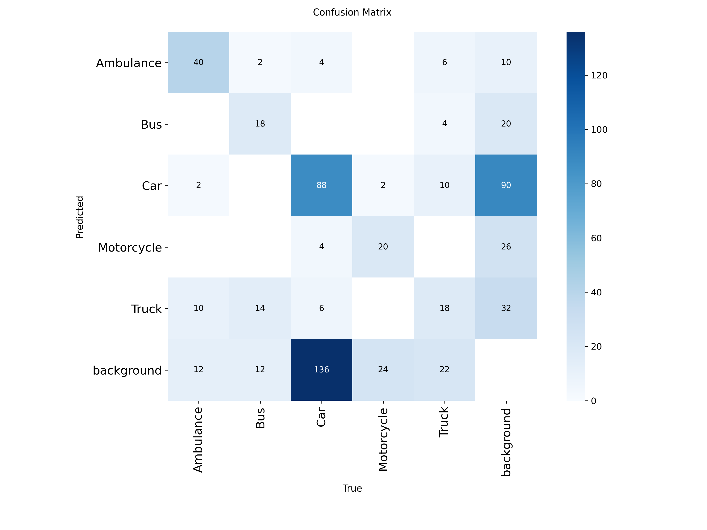

# 🚗🚑🚚 Vehicle Detection Using YOLOv8
YOLO V8 Car Detection
## Overview
This mini project demonstrates **vehicle detection** using YOLOv8 (Ultralytics) to identify several classes of vehicles in images, including **Ambulance, Bus, Car, Motorcycle, Truck**, and `background`.  
To make this project interactive, I also developed a simple **Streamlit demo app**.

---

## Dataset

- **Source:** [Cars Detection Dataset on Kaggle](https://www.kaggle.com/datasets/abdallahwagih/cars-detection)
- The dataset contains labeled images with the following classes: `Ambulance`, `Bus`, `Car`, `Motorcycle`, `Truck`, and `background`.
- Data is split into `train`, `valid`, and `test` directories.

---

## Model & Training Details

- **Model:** YOLOv8m (Ultralytics 8.3.152)
- **Framework:** PyTorch
- **Environment:** Google Colab, NVIDIA Tesla T4 GPU (CUDA)
- **Epochs:** 100

---

## Results

### Confusion Matrix

Below is the confusion matrix from the validation set:

<p align="center">
  
</p>

---
### Metrics
- **mAP50-95 (all classes):** 0.350
- The model demonstrates decent performance on several vehicle classes, especially Ambulance and Bus.
  
---

## Streamlit Demo

A simple **Streamlit app** is included for interactive demo of the vehicle detection model.  
You can upload an image and see the detection results instantly.

### How to Run the Demo

1. **Install dependencies:**
    ```bash
    pip install -r requirements.txt
    ```

2. **Run Streamlit:**
    ```bash
    streamlit run app.py
    ```

3. **Upload an image or video** and view the detected vehicles on the web interface.
